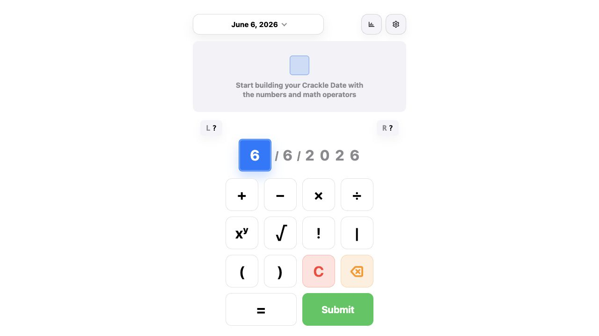
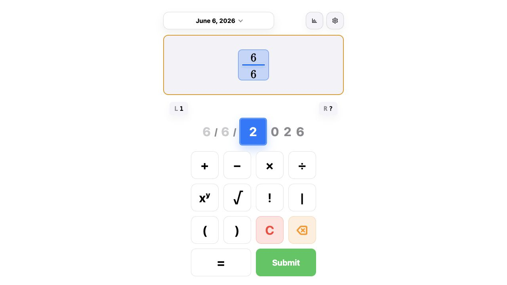
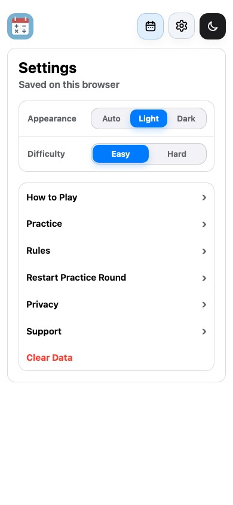

# Crackle Date Web

This is the deployable web version of Crackle Date for `crackledate.com`.

## Screenshots

<p>
  
  
  
</p>

## Stack

- React + Vite frontend for the playable browser board.
- Go backend for puzzle date metadata, expression evaluation, and equation validation.
- A single Docker image serves the React build and `/api/*` routes.
- Guided First Crack onboarding, local saves, no ads or in-app purchases, open date access, a Practice sandbox, and written Rules.

This keeps the runtime small and simple: the single container can sit behind any HTTPS reverse proxy or tunnel, while React handles the equation-builder interaction.

## Local Development

Open the hot-reload local app at `http://localhost:5173/`.

From the repo root:

```bash
npm run dev
```

This starts the Go API on `http://localhost:5174` and the Vite frontend on
`http://localhost:5173`. Frontend changes hot reload through Vite, and backend
changes under `cmd/` or `internal/` restart the API automatically.

Override the API port with `CRACKLEDATE_API_PORT` if needed.

You can also run the two processes manually.

Frontend:

```bash
cd frontend
npm ci
npm run dev
```

Backend:

```bash
go run ./cmd/server
```

The Vite dev server proxies `/api` to `http://localhost:8080`.

## Environment

- `PORT`: backend HTTP port; defaults to `8080`.
- `TRUSTED_PROXY_CIDRS` and `TRUSTED_CLOUDFLARE_PROXY_CIDRS`: separate comma-delimited trusted-proxy lists. Both default empty.
- `MAX_CONCURRENT_HINT_SOLVES`: optional bounded hint-solver concurrency override.

## Docker

```bash
DEV_PROJECT=crackledate-web-dev-your-unique-checkout-id
docker compose --env-file /dev/null -f "$PWD/docker-compose.yml" --project-directory "$PWD" --project-name "$DEV_PROJECT" config --quiet
docker compose --env-file /dev/null -f "$PWD/docker-compose.yml" --project-directory "$PWD" --project-name "$DEV_PROJECT" up --build -d
curl -I http://127.0.0.1:8082
```

Replace the project-name suffix with a value unique to this checkout; never rely on the directory-derived default when sibling checkouts may be present. The service has no storage mount. The detached legacy production volume remains governed by [the stateless submissions-data decommission runbook](docs/runbooks/submissions-database.md): never guess a target, delete at startup, or run `docker compose down -v`.

The Compose file binds the container to loopback so it is intended to be reached through the host's reverse proxy rather than directly exposed. Repository validation is non-outputting: use `scripts/verify_compose.sh`, which permits only `docker compose config --quiet`.

## Routes

- `/` playable Crackle Date board
- `/privacy/` privacy policy
- `/support/` support page
- `/api/health`
- `/api/puzzle?date=YYYY-MM-DD`
- `/api/evaluate`
- `/api/validate`

Browser-local saves are the only durable player history. The server retains no gameplay submissions, and unknown API routes return JSON 404.

JSON API request bodies are capped at 32 KiB. Evaluation, validation, and hint
requests are rate-limited in bounded memory to reduce resource-exhaustion attempts.

Crackle Date does not show ads or offer in-app purchases. Past, current, and future dates
open without paid unlocks.

Guided First Crack is the first-time web onboarding path. It uses the shared
Android/iOS route policy and starts the Practice Round guided tutorial, which highlights each
next step until the full sample solution is submitted.

Practice is a sandbox reachable from Settings and is also the guided tutorial. It uses the shared
June 19, 2026 sample round and validates equations without saving progress.

Rules is a written Settings destination separate from Cracked Instructions. It documents
digit order, the leading-zero rule, the equals-sign requirement, practice boundaries,
and open date access without ads or purchases.

Share payloads follow the shared Android contract: daily shares include progress without
revealing the equation, while saved-solution shares include the equation, value, and solve time.

Calendar is the saved-history destination. For the selected date it shows locally saved
equations, solve times, and a rounded average of positive recorded solve times. The post-solve
panel keeps immediate streak/month context, spoiler-free sharing, and actions for continued play.

Crackle Date has no ads, purchases, accounts, tracking, public profiles, or cloud gameplay
history. Saved equations, solve times, streaks, settings, theme, difficulty, and onboarding
progress stay in this browser. The service processes gameplay requests only long enough to
respond and logs only timestamp, level, method, path, status, and duration.
